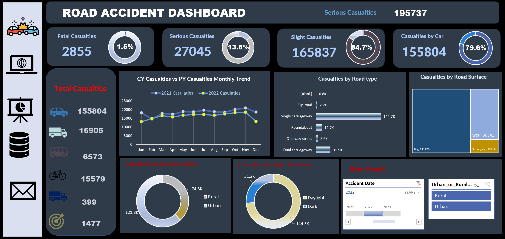

# Road-Accident-Analysis-Dashboard
# 📊 Road Accident Analysis Dashboard

## 📌 Project Overview
This project presents an interactive **Road Accident Analysis Dashboard** that visualizes and analyzes traffic accident data. The dashboard highlights key patterns related to casualty severity, vehicle types, road conditions, locations, and yearly trends to support better understanding of road safety issues.

---

## 🎯 Project Objectives
- Analyze **total casualties** and classify them into Fatal, Serious, and Slight injuries
- Compare **current year (CY)** and **previous year (PY)** accident trends
- Identify accident patterns by **road type**, **road surface**, and **light condition**
- Analyze casualties by **vehicle type**
- Provide an interactive dashboard for easy data exploration

---

## 📂 Dataset Description
The dataset contains road accident records with the following attributes:
- Accident date and year
- Casualty severity (Fatal, Serious, Slight)
- Vehicle type (Car, Truck, Bus, Bicycle, etc.)
- Road type (Single carriageway, Dual carriageway, Roundabout, etc.)
- Road surface condition (Dry, Wet, Snow/Ice)
- Light condition (Daylight, Dark)
- Area type (Urban, Rural)

---

## 📈 Dashboard Features

### 🔹 Key Metrics
- Total Casualties
- Fatal Casualties
- Serious Casualties
- Slight Casualties
- Casualties by Car

### 🔹 Trend Analysis
- Monthly comparison of casualties between **2021 and 2022**

### 🔹 Breakdown Analysis
- Casualties by Road Type
- Casualties by Road Surface Condition
- Casualties by Light Condition
- Casualties by Location (Urban vs Rural)
- Casualties by Vehicle Type

### 🔹 Interactive Filters
- Year selection (2021–2023)
- Urban / Rural area filter

---

## 🛠 Tools & Technologies
- **Power BI** – Data visualization and dashboard development
- **Excel / CSV** – Data preprocessing
- **DAX** – Calculations and measures

---

## 📊 Key Insights
- The majority of casualties are **slight injuries**
- **Cars** account for the highest number of casualties
- Most accidents occur on **single carriageway roads**
- **Dry road conditions** still show a high number of accidents
- **Urban areas** record more casualties than rural areas
- Accidents occur more frequently during **daylight**

---

## 🖼 Dashboard Preview
)

---

## 🚀 How to Use
1. Clone or download this repository
2. Open the Power BI file (`.pbix`)
3. Use filters to explore trends by year and area
4. Analyze insights using interactive visuals

---

## 📌 Conclusion
This dashboard provides a clear and interactive analysis of road accident data. It helps identify risk factors and trends that can support road safety planning and decision-making.

---

## 👩‍💻 Author
**Your Name**  
Data Science Student | Aspiring Data Analyst  
GitHub: https://github.com/sreykhuoch04
